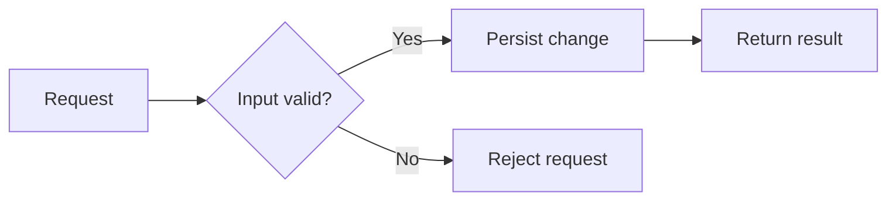
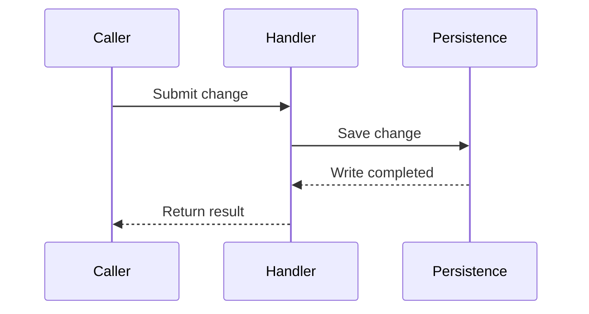
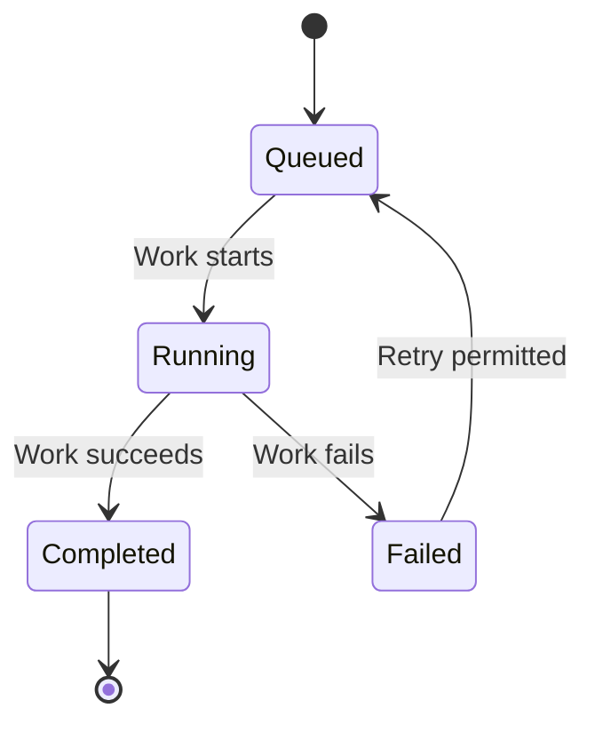

## Examples of adapting the presentation

The examples are deliberately independent. Choose the ones that help the actual request;
they are not sections to assemble into every plan.

### A small correction

A short paragraph can carry the whole plan:

> Correct the required-field message in the owning form. Reuse its existing translation
> entry and verify that an empty submission displays the updated message.

### Comparing approaches before a decision

For an illustrative status-update question, common comparison dimensions make a table useful:

| Approach         | Benefit                             | Tradeoff                                 |
| ---------------- | ----------------------------------- | ---------------------------------------- |
| Explicit refresh | Uses the existing request path      | The user asks for each update            |
| Periodic polling | Updates while the page remains open | Sends requests even when nothing changes |

The final plan would name the selected approach and its reason once the decision is resolved.
Do not add alternatives that were never relevant to the request.

### Showing a proposed flow

This illustrative target shows data moving through validation and persistence. Arrows mean
processing order; a rejected request ends without a write.

In prose: validate the input, reject invalid requests, and persist valid changes before
returning their result. The owning contract determines the actual validation and errors.

### Showing exchanges over time

This illustrative target distinguishes the request to save from the confirmation that the
write completed. Solid arrows are requests; dashed arrows are responses. Vertical order
shows the sequence.

In prose: the handler returns the result after persistence confirms the write. This is the
successful exchange only; explain failures separately when they matter to the request.

### Showing a lifecycle

This illustrative target explains a retryable job. Arrows are state transitions, and their
labels identify the event that permits each transition.

In prose: a queued job runs, then completes or fails. A failed job returns to the queue only
when a retry is permitted. The example does not define a retry policy; a real plan must use
the owning contract rather than infer one from the drawing.

Examples are illustrative, not claims about the repository. Use only those that clarify the request.
