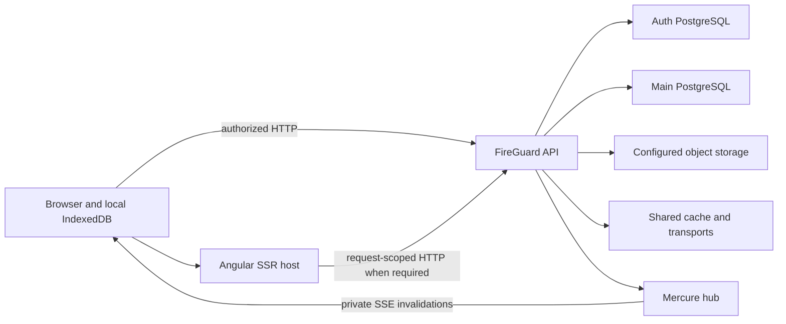

# Web system overview

This runtime view places the frontend in the FireGuard system. It describes request flow, not TypeScript import permissions.

**Authoritative references:** [Architecture](../../ARCHITECTURE.md) · [Organization](../../src/app/features/organization/FEATURE.md).

## Runtime services

Arrows show runtime requests, storage ownership and realtime delivery. Database/cache/storage access stays behind the API; the web client owns only its browser state and local drafts.

The browser owns device-local drafts and replay queues. The API authorizes durable
business operations; Mercure signals changes and does not replace authorized HTTP
reads. SSR has an explicit request/hydration lifecycle and cannot use browser-only
storage. Shared cache and object storage are API-managed dependencies; their data
never becomes device-local draft state merely because the web client uses it.
Public runtime configuration is supplied by the deployed SSR host.

## Business boundaries

Organization publishes context and access. Nested owners handle their business
workflows; account owns personal data, auth owns identity flows, and layouts compose
their public contributions. Generic infrastructure belongs to core; domain-agnostic
UI belongs to shared. Follow the import rules in the architecture contract.

See [SSR](../guides/ssr-and-hydration.md), [collaboration](../guides/collaboration.md)
and [offline interventions](../guides/interventions-and-offline.md) for the detailed
lifecycle. The [API repository](https://github.com/DevSkyLex/fireguard-api) owns
database mapping and backend security contracts.
