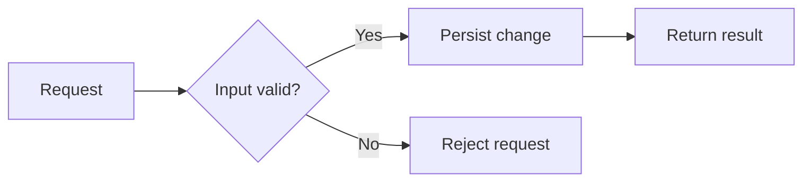
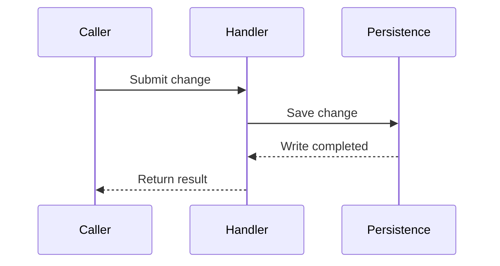
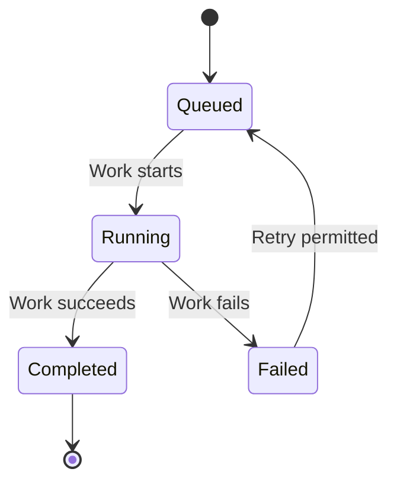

# Planning and explaining changes

This guide helps choose a useful presentation for plans and complex explanations in Codex
and Claude. The repository's [agent instructions](../../AGENTS.md) and architectural
contracts remain authoritative. The examples below illustrate presentation choices; they
do not describe existing FireGuard behavior or authorize new architecture.

## Start with the reader's question

Choose the presentation that makes the subject easier to understand, with detail proportional
to the task. A reader should understand the intended result, the decisions and their reasons,
the changes needed, and how success will be checked. These are useful information, not
mandatory headings or a fixed outline.

Use the user's language. Explicit requests about format, length or detail take priority.
Keep a small correction compact; give a complex flow enough explanation to make its
dependencies and important failure cases understandable. Distinguish verified current
behavior from proposed behavior and assumptions. Resolve decisions that block the plan
before presenting it as ready for implementation.

## Select a format for a purpose

| Reader's need | Useful presentation |
| --- | --- |
| Understand components, dependencies or data movement | Mermaid flowchart |
| Follow exchanges between actors over time | Mermaid sequence diagram |
| Understand transitions and a lifecycle | Mermaid state diagram |
| Compare options, contracts or current and proposed behavior | Markdown table |
| Follow steps whose order matters | Numbered list |
| Understand an interface or a concrete behavior | Short code, input/output or scenario example |
| Find supporting evidence or navigate an explanation | Links, descriptive headings and focused emphasis |

These are examples, not an exhaustive menu or mandatory mapping. Plain prose is a complete
option. There is no diagram or table quota, fixed section count, or requirement to explain
why a visual was omitted. A table helps when rows share comparison dimensions; a list or
paragraph can be clearer when each item needs a different explanation.

Use checkboxes for an actual execution checklist when useful, rather than implying that a
proposed action has been completed. Use fenced code blocks with a language label for concrete
interfaces or examples. Keep headings and emphasis focused on the decisions that matter.
Prefer portable Markdown; the explanation should still be understandable if a diagram
does not render in the reader's client.

## Keep the explanation and visuals aligned

Place each illustration beside the explanation it supports. Introduce its purpose, clarify
the meaning and direction of arrows, and provide a short prose equivalent. Label whether
it shows current behavior, a proposed target, or an illustrative example.

Use readable labels and show only the relationships relevant to the decision. When a diagram
becomes difficult to follow, simplify it or split it by concern. Do not add components,
dependencies or decisions merely to complete a diagram. Include a failure path or boundary
when it matters to the proposed change.

Update the prose, tables and diagrams together when revising a plan. Link to precise
repository evidence for claims about current behavior; identify assumptions rather than
drawing them as established facts. A parser or renderer check establishes syntax, while
visual inspection establishes whether the diagram communicates the intended relationship.

## Examples of adapting the presentation

The examples are deliberately independent. Choose the ones that help the actual request;
they are not sections to assemble into every plan.

### A small correction

A short paragraph can carry the whole plan:

> Correct the required-field message in the owning form. Reuse its existing translation
> entry and verify that an empty submission displays the updated message.

### Comparing approaches before a decision

For an illustrative status-update question, common comparison dimensions make a table useful:

| Approach | Benefit | Tradeoff |
| --- | --- | --- |
| Explicit refresh | Uses the existing request path | The user asks for each update |
| Periodic polling | Updates while the page remains open | Sends requests even when nothing changes |

The final plan would name the selected approach and its reason once the decision is resolved.
Do not add alternatives that were never relevant to the request.

### Showing a proposed flow

This illustrative target shows data moving through validation and persistence. Arrows mean
processing order; a rejected request ends without a write.

In prose: validate the input, reject invalid requests, and persist valid changes before
returning their result. The owning contract determines the actual validation and errors.

### Showing exchanges over time

This illustrative target distinguishes the request to save from the confirmation that the
write completed. Solid arrows are requests; dashed arrows are responses. Vertical order
shows the sequence.

In prose: the handler returns the result after persistence confirms the write. This is the
successful exchange only; explain failures separately when they matter to the request.

### Showing a lifecycle

This illustrative target explains a retryable job. Arrows are state transitions, and their
labels identify the event that permits each transition.

In prose: a queued job runs, then completes or fails. A failed job returns to the queue only
when a retry is permitted. The example does not define a retry policy; a real plan must use
the owning contract rather than infer one from the drawing.

## Review the result proportionally

Check whether the explanation answers the reader's question, the chosen formats add clarity,
and the intended checks demonstrate success. Remove repetition and decorative structure.
For Mermaid stored in repository documentation, use the existing documentation renderer and
inspect the resulting labels and layout. Report an unavailable rendering or client check
accurately; do not claim that static validation proves behavior in a fresh conversation.
