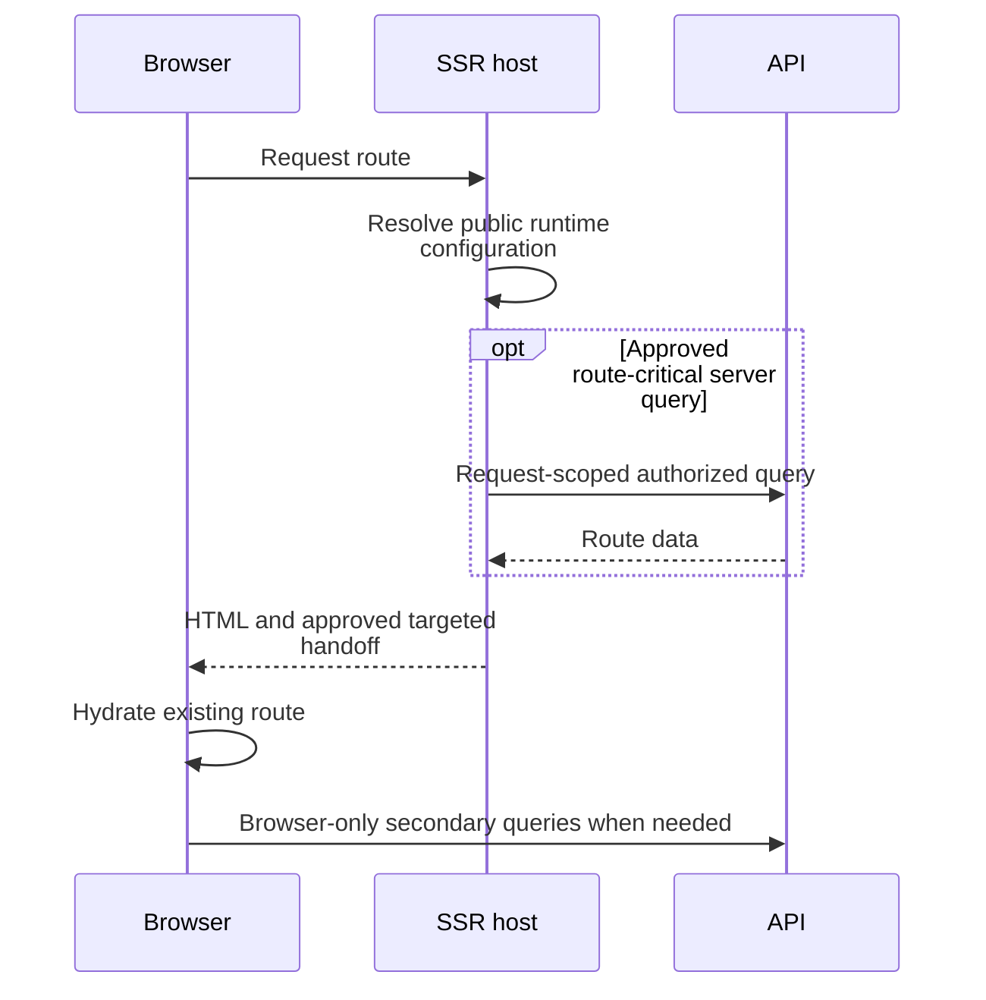

# SSR and hydration

Separate request-scoped server rendering, hydration and later browser navigation. Each owned query needs one deliberate loading path.

**Authoritative references:** [Architecture](../../ARCHITECTURE.md) · [Core](../../src/app/core/README.md) · [Deployment](../../DEPLOYMENT.md).

## Loading lifecycle

A route request is rendered before browser hydration. Only an approved route-critical query participates in server loading; secondary reads start in their owned browser lifecycle.

Resolvers load only route-critical data and seed the owner, use an explicit targeted
handoff, or provide the query's sole loading path. A page must not immediately repeat
that query. Store lifecycle, resolver and page responsibilities must agree.

## Transfer boundaries

Public runtime configuration can cross to the browser. Do not serialize bearer
tokens, secrets or broad authenticated responses into TransferState. Authenticated
server work is scoped to the request; request-less contexts have explicit behavior.

Secondary tabs, pickers and overlays normally load in the browser or on interaction.
IndexedDB, Mercure connections and device resources have browser-only lifecycles.
The owning `FEATURE.md` records any sanctioned exception.

## Verification

The hermetic SPA suite does not prove SSR. Use the real SSR smoke procedure in
[tests/e2e/README.md](../../tests/e2e/README.md), including its isolated API fixture and ports.
Check duplicate requests, public configuration bootstrap, hydration and disposal.
